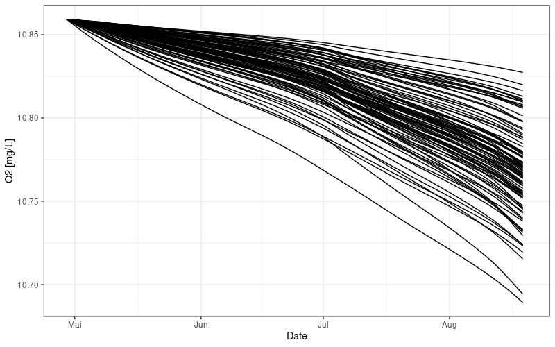
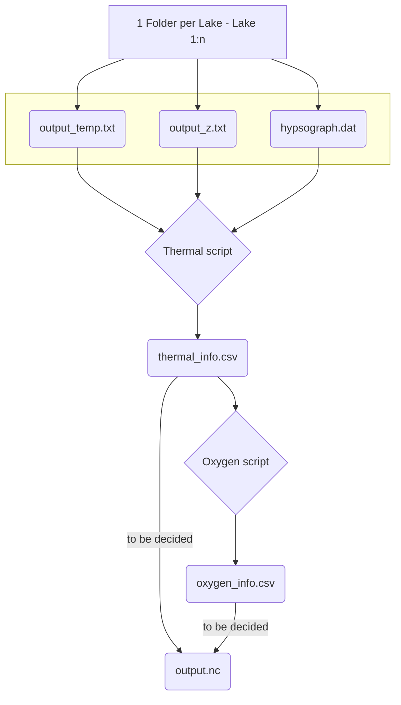

# EezyPeezyISIOxy

This repository is being used to develop a workflow for analyzing the ISIMIP-3a data to study the effects of climate change on lake hypolimnetic oxygen dynamics and originated at the GLEON 2022 conference at Lake George, NY.

Contacts: co-champions Carolina Barbosa and Philipp Keller

Working group members: Cayelan Carey, Chloe Faehndrich, Robert Ladwig, Sofia LaFuente, Rafa Marce, Daniel Mercado-Battin, Lipa Nwala

GIT-HUB sources:
https://www.youtube.com/watch?v=B-FHx4l1BNU 

## Flowchart

